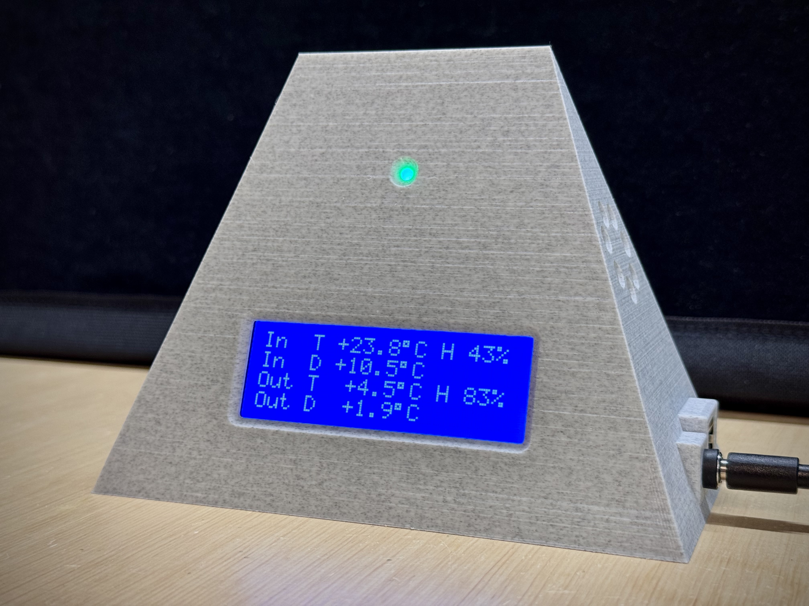

# Dew Point Thermometer with LoRa and Internet Connectivity



## Table of Contents
- [Introduction and Motivation](#introduction-and-motivation)
- [Features](#features)
- [Design Principles](#design-principles)
- [Hardware Components](#hardware-components)
- [Wiring](#wiring)
- [Frequency, Sync Word, and CRC](#frequency-sync-word-and-crc)
- [Software Setup](#software-setup)
- [Usage](#usage)
- [Maintenance and Troubleshooting](#maintenance-and-troubleshooting)
- [Power and Housing](#power-and-housing)
- [Future Enhancements](#future-enhancements)
- [License](#license)

## Introduction and Motivation

This project implements a robust dew point thermometer system with **indoor** and **outdoor** stations. The **outdoor station** measures temperature/humidity with an SHT85 sensor and transmits data via LoRa. The **indoor station** receives this data, measures its own conditions, calculates both indoor and outdoor dew points, and determines if airing the house out would help control indoor humidity. An LED indicator provides a quick visual guide for whether or not to ventilate, and a LCD display shows the current measured and calculated values for indoor & outdoor. The system is connected to Adafruit Cloud for tracking and graphing data. 

By employing a unique LoRa sync word, CRC checks, ensuring network connectivity before I/O operations, and using timed intervals for tasks, the system remains responsive and reliable—even in noisy RF environments or when the Ethernet cable is disconnected. Additionally, a logic level converter (level shifter) is required for the LCD if it operates at 5V while the rest of the system runs at 3.3V.

## Features

- **Indoor/Outdoor Measurements:**  
  Indoor station monitors its own temp/hum, receives outdoor data for comparative dew point analysis.

- **Dew Point Calculation & Humidity Control:**  
  Compares indoor and outdoor dew points to assess the benefit of airing out to reduce indoor humidity.

- **LED Indicators for Ventilation:**
  - **Green LED:** Outdoor conditions favor lowering indoor humidity by airing.
  - **Red LED:** No benefit from airing.
  - **Off:** Borderline conditions, marginal benefit.

- **Robust LoRa Communication:**
  - Unique sync word, CRC for reliable data in noisy environments.
  - Operates at 868.1 MHz (EU ISM band).

- **Non-Blocking, Responsive Operation:**
  - Timed intervals for sensor reads, LCD updates, Adafruit IO uploads.
  - Avoids stalling during network issues.

- **Failure Recovery:**
  - Reinitializes SHT85 and LoRa after multiple failures.
  - Resets outdoor values if no data for 1 minute.

- **Optional Cloud Connectivity (Adafruit IO):**
  - Uploads data every 5 minutes if Wi-Fi or Ethernet is connected.
  - Skips uploads gracefully if disconnected.

## Design Principles

1. **Reliability in Noise:**  
   - Unique sync word and CRC filter interference.
   - Verifies network connectivity before I/O ops.

2. **Non-Blocking Operation:**  
   - Uses timed intervals to prevent system stalls.

3. **Error Handling & Recovery:**  
   - Reinitializes sensors and LoRa on failures.
   - Clears old outdoor data if no updates in 1 minute.

4. **Modularity & Maintainability:**  
   - Separate indoor/outdoor code.
   - Clear logic and timing-based structure.

## Hardware Components

### Outdoor Station
- ESP32 (or similar MCU)
- SHT85 Temp/Hum Sensor (3.3V)
- LoRa Module (SX1276/SX1278, 3.3V)
- Stable 3.3V power supply or use a DC-DC step down module

### Indoor Station
- ESP32 (Wi-Fi and/or W5500 Ethernet, all 3.3V)
- SHT85 Temp/Hum Sensor (3.3V)
- LoRa Module (3.3V)
- 20x4 I2C LCD Display (requires 5V)
- Bi-Color LED or separate Red/Green LEDs (3.3V via PWM)
- **Logic Level Converter for LCD I2C Lines**  
  (The LCD is powered at 5V, while ESP32 I2C lines are 3.3V. A level shifter ensures proper logic levels.)
- Stable 5V supply via DC-DC step down module. For 3.3V, sinmply use ESP 3.3V out. 

## Wiring

**Note:** The ESP32 and LoRa, SHT85, Ethernet modules operate at 3.3V logic. The LCD typically requires 5V and is not 3.3V tolerant on I2C lines. Use a bidirectional logic level converter for I2C SDA and SCL lines between ESP32 (3.3V) and LCD (5V).


**SHT85 to ESP32 (Both Stations, 3.3V):**
| SHT85 Pin | ESP32 Pin | Notes        |
|-----------|-----------|--------------|
| SCL       | GPIO22    | I2C Clock (3.3V) |
| SDA       | GPIO21    | I2C Data (3.3V)  |
| VCC       | 3.3V      | Power        |
| GND       | GND       | Ground       |

**LoRa Module to ESP32 (3.3V):**
| LoRa Pin | ESP32 Pin | Notes                      |
|----------|-----------|----------------------------|
| SCK      | GPIO18    | SPI Clock (shared)         |
| MISO     | GPIO19    | SPI MISO (shared)          |
| MOSI     | GPIO23    | SPI MOSI (shared)          |
| NSS (CS) | GPIO5     | LoRa Chip Select           |
| RST      | GPIO27    | LoRa Reset                 |
| DIO0     | -1 or 33  | Not used indoor or GPIO33 if used outdoor |
| VCC      | 3.3V      | Power                      |
| GND      | GND       | Ground                     |

**LCD (I2C) to ESP32 via Level Shifter:**
- The LCD requires 5V power and 5V logic on SDA/SCL.  
- ESP32 runs at 3.3V logic. Use a bidirectional logic level converter on SDA and SCL lines.

| LCD Pin | Level Shifter | ESP32 Pin | Notes                       |
|---------|---------------|-----------|-----------------------------|
| SDA (5V)| ↔ SDA (3.3V)  | GPIO21    | I2C Data through level shifter |
| SCL (5V)| ↔ SCL (3.3V)  | GPIO22    | I2C Clock through level shifter|
| VCC     | 5V            | -         | LCD Power (5V)              |
| GND     | GND           | -         | Ground shared               |

**Ethernet (W5500) to ESP32 (Optional, 3.3V):**
| W5500 Pin | ESP32 Pin | Notes           |
|-----------|-----------|-----------------|
| SCK       | GPIO18    | SPI Clock       |
| MISO      | GPIO19    | SPI MISO        |
| MOSI      | GPIO23    | SPI MOSI        |
| CS        | GPIO4     | W5500 CS        |
| VCC       | 3.3V      | Power           |
| GND       | GND       | Ground          |

**LEDs (3.3V):**
| LED Pin        | ESP32 Pin | Notes                         |
|----------------|-----------|--------------------------------|
| RED_LED_PIN    | GPIO25    | Red LED with resistor, 3.3V logic |
| GREEN_LED_PIN  | GPIO26    | Green LED with resistor, 3.3V logic |

## Frequency, Sync Word, and CRC

```cpp
const long frequency = 868100000; // 868.1 MHz for EU ISM band
LoRa.setSyncWord(0x13); // Unique sync word for your network
LoRa.enableCrc(); // Ensure packet integrity with CRC
```

## Software Setup

1. **Clone Repository:**
   ```bash
   git clone https://github.com/yourusername/dew-point-thermometer.git
   cd dew-point-thermometer
   ```

2. **Install Required Libraries:**
   - [arduino-LoRa](https://github.com/sandeepmistry/arduino-LoRa)
   - [Ethernet_Generic](https://github.com/khoih-prog/Ethernet_Generic)
   - [LiquidCrystal_I2C](https://github.com/johnrickman/LiquidCrystal_I2C)
   - [SHTSensor](https://github.com/Sensirion/arduino-sht)
   - [AdafruitIO_WiFi](https://github.com/adafruit/Adafruit_IO_Arduino)
   - [AdafruitIO_Ethernet](https://github.com/adafruit/Adafruit_IO_Arduino)

3. **Configure Credentials:**
   - In indoor code:
     ```cpp
     const char* ssid = "YourWiFiSSID";
     const char* password = "YourWiFiPassword";
     ```
     ```cpp
     #define IO_USERNAME "your_adafruit_io_username"
     #define IO_KEY "your_adafruit_io_key"
     ```

4. **Upload Code:**
   - Upload `OutdoorStation.ino` to outdoor ESP32.
   - Upload `IndoorStation.ino` to indoor ESP32.
   - Ensure same frequency & sync word on both units.

## Housing


- **Outdoor Unit:**  
  Weatherproof enclosure, ensure airflow for accurate humidity readings.
  Good quality housing: TFA Dostmann Potective Cover for Transmitter 

- **Indoor Unit:**  
  [3D STL file](IndoorHousing.stl)


## Usage

1. **Power Up Both Units:**
   - Outdoor waits for `REQ` and sends T/H data.
   - Indoor requests outdoor data, measures indoor conditions, calculates dew points.

2. **LED Ventilation Guidance:**
   - Green: Airing out helps reduce indoor humidity.
   - Red: No benefit from airing out.
   - Off: Borderline conditions.

3. **Cloud Upload (Optional):**
   - If connected, indoor uploads data to Adafruit IO every 5 mins.

4. **Automatic Recovery:**
   - Outdoor data resets after 1 minute if no updates.
   - Sensor and LoRa reinitialized after repeated failures.

## Maintenance and Troubleshooting

- **Sensor Issues:**  
  Check SHT85 wiring. Code attempts reinitialization after multiple failures.

- **LoRa Communication Problems:**  
  Ensure same frequency, sync word, and CRC on both ends.  
  Check antennas and signal environment.

- **LCD or LED Problems:**  
  Verify I2C address and wiring for LCD.  
  Use a level shifter for I2C lines since LCD runs at 5V.  
  Check LED pins and resistor values.

- **Network Failures:**  
  Check Wi-Fi credentials or Ethernet cable and DHCP.  
  Code retries periodically without blocking main loop.


## License

This project is released under the [MIT License](LICENSE).
