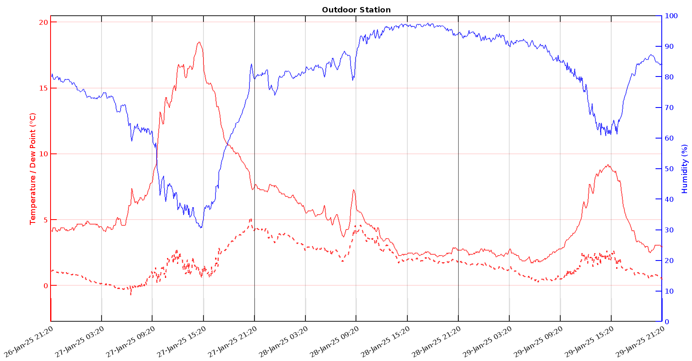
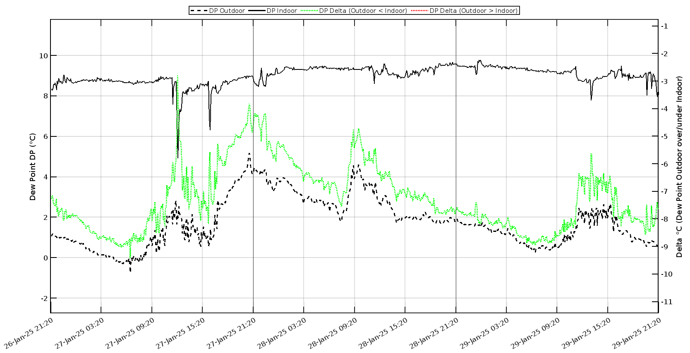

# Dew Point Thermometer with LoRa and Internet Connectivity

|  | 
|:--:| 
| *T = Temperature, H = Humidity, D = Dewpoint. Significant delta in D between indoor and outdoor indicated by LED* |

## Table of Contents
- [Introduction and Motivation](#introduction-and-motivation)
- [Features](#features)
- [Hardware Components](#hardware-components)
- [Wiring](#wiring)
- [LORA Settings](#lora-settings)
- [Housing](#housing)
- [Advanced Matlab Visualization with ThingSpeak and Adafruit IO](#advanced-matlab-visualization-with-thingspeak-and-adafruit-io)
- [Usage](#usage)
- [Maintenance and Troubleshooting](#maintenance-and-troubleshooting)
- [Changelog](#changelog)
- [License](#license)

## Introduction and Motivation

In atmospheric science and indoor air quality management, the **dew point** is a critical metric. It represents the temperature at which the water vapor in the air becomes saturated and begins to condense into liquid water. A higher dew point indicates more moisture in the air, often leading to discomfort, potential mold growth, and structural damage. By understanding and controlling dew point, one can maintain healthier, more comfortable indoor conditions, prevent condensation-related issues, and optimize energy usage for heating and cooling. Monitoring dew point is thus invaluable in achieving both human comfort and long-term preservation of building materials.

This project implements a robust dew point thermometer system with a base station that connects via Lora to an indoor and outdoor sensor. The sensors measures temperature/humidity with a highly accurate SHT85 sensor. The base station receives this data from both sensors, calculates both indoor and outdoor dew points, and determines if airing the house out would help reduce indoor humidity or not. An LED indicator provides a quick visual guide for whether or not to ventilate, and an LCD display shows the current measured and calculated values for indoor & outdoor conditions. 

Data is uploaded (optionally) to Adafruit IO or ThingSpeak, allowing for continuous tracking, graphing, and advanced Matlab visualizations. A unique LoRa sync word and CRC checks ensure robust data transmission even in noisy RF environments, with dual-network support (Wi-Fi and Ethernet) for improved connectivity and graceful recovery during disconnections.

By employing a unique LoRa sync word, CRC checks, ensuring network connectivity before I/O operations, and using timed intervals for tasks, the system remains responsive and reliable—even in noisy RF environments or when Wifi or the Ethernet cable get disconnected. 

The system’s modular architecture supports easy upgrades, including additional sensor types such as battery voltage monitoring using precise ADC calibration, which is included for demonstration purposes. 

By employing timed intervals for sensor readings, network operations, and data uploads, the system remains responsive and reliable even in challenging conditions, making it an effective tool for both scientific research and practical indoor air quality management.


## Features

- **Indoor/Outdoor Measurements:**  
  The system uses separate LoRa sensor nodes for indoor and outdoor measurements. Each node sends temperature/humidity (and battery voltage, where applicable) data autonomously at set intervals. In V1, the indoor sensor was mounted at the back of the base station, but self-heating from the LCD lighting skewed measurements. Separating the sensors from the base station has resolved this issue. 


- **Scientific Dew Point Calculation Using the Magnus Approximation:**  
  The dew point can be approximated using the Magnus–Tetens formula, which provides a practical way to compute dew point (`D`) based on temperature (`T`) and relative humidity (`H`). Different constants are used depending on whether the temperature is above or below 0°C:

     ```cpp
  double calculateDewPoint(double temp, double hum) {
  double a, b;
  if (temp >= 0.0) {
    a = 17.62; b = 243.12;
  } else {
    a = 22.46; b = 272.62;
  }
  double rh = hum / 100.0;
  double alpha = log(rh) + (a * temp / (b + temp));
  return (b * alpha) / (a - alpha);
  }
     ```
 
- **Enhanced Humidity & Atmospheric Analysis:**  
  - **Dew Point & Water Vapor Density:**  
    In addition to dew point, the system calculates water vapor density from the dew point, offering a more detailed insight into ambient moisture conditions.
  - **Humidity Control:**  
    Compares indoor and outdoor dew points to assess the benefits of airing out spaces to reduce indoor humidity.

- **LED Indicators for Ventilation & Ambient Conditions:**  
  - **Green LED:** Activates when outdoor conditions are favorable for reducing indoor humidity (dew point difference > 5°C).
  - **Red LED:** Illuminates when there is little to no benefit from airing (dew point difference ≤ 0°C or stale data).
  - **Off/Dimmed:** Indicates borderline conditions (dew point difference between 0°C and 5°C) and automatically turns off in low-light environments (using an LDR sensor) to conserve energy and reduce glare.

- **Robust LoRa Communication:**  
  Utilizes a unique sync word and CRC checks to ensure reliable data transmission in noisy environments. It is configured for operation on the 868 MHz band with optimized settings for range and reliability.

- **Flexible and Modular Cloud Connectivity:**  
  - **Multiple Platform Support:**  
    In addition to Adafruit IO, the system now supports ThingSpeak for data uploads. Users can easily switch between PLATFORM_ADAFRUIT, PLATFORM_THINGSPEAK, or disable cloud connectivity with PLATFORM_NONE.
  - **Scheduled Uploads:**  
    Sensor data is uploaded at regular intervals (every 5 minutes) if either Wi-Fi or Ethernet connectivity is available.
  - **Graceful Degradation:**  
    The system skips uploads if no network connection is available, ensuring continued operation without disruption.

- **Improved Network Reliability and Recovery:**  
  Dual-network support with both Wi-Fi and Ethernet options, enhanced connection retry logic, and robust reconnection attempts help handle network outages without stalling system operations.

- **Non-Blocking, Responsive Operation:**  
  Uses timed intervals for sensor reads, LCD updates, and data uploads. The code is structured to avoid blocking operations, ensuring smooth operation even during network reconnection attempts or when sensor data is stale.

- **Battery Monitoring & Advanced Sensor Variants:**  
  - **Battery Voltage Measurement:**  
    New sensor variants now include battery voltage readings, computed using precise ADC calibration and voltage divider calculations.
  - **Dual Sensor Firmware:**  
    Separate firmware versions for the standard environmental sensor and a dedicated voltage sensor allow for tailored operation and improved accuracy in battery monitoring.

- **Code Organization and Modular Design:**  
  Refactored LCD display routines with helper functions for clear and organized output, and centralized data upload functionality via a DataUploader abstraction, simplifying future expansions and maintenance.


## Hardware Components

### Sensors (Indoor and Outdoor Temperature & Humidity)
- ESP32 (or similar MCU)
- SHT85 Temp/Hum Sensor (3.3V)
- LoRa Module (SX1276/SX1278, 3.3V)
- Stable 3.3V power supply or use a DC-DC step down module

### Indoor Base Station
- ESP32 with EiFi (3.3V)
- W5500 Ethernet Module (3.3V)
- LoRa Module (SX1276, 3.3V)
- 20x4 I2C LCD Display (5.0V)
- Logic Level Converter for LCD I2C Lines, e.g. TXS0108E
- Bi-Color LED or separate Red/Green LEDs (3.3V via PWM) + 470 Ohm Resistor
- LDR GL5528
- Stable 5V supply via DC-DC step down module. For 3.3V, simply use the ESP 3.3V out. 

## Wiring

**Note:** The ESP32, LoRa, and Ethernet modules operate at 3.3V logic. The LCD typically requires 5V and is not 3.3V tolerant on I2C lines. Use a bidirectional logic level converter for I2C SDA and SCL lines between ESP32 (3.3V) and LCD (5V).

|  | 
|:--:| 
| *Left: Wiring & Prototype Testing. Top Right: LCD Display Testing. Bottom Right: Assembled Components* |

Below are the wiring instructions. Use short, direct references and keep related signals grouped. All components except the LCD and LEDs run at 3.3V logic. The LCD is 5V and requires a logic level converter for the I2C lines.


### Indoor Station Wiring

**LoRa Module (3.3V SPI):**
- SCK -> ESP32 GPIO18
- MISO -> ESP32 GPIO19
- MOSI -> ESP32 GPIO23
- NSS (CS) -> ESP32 GPIO5
- RST -> ESP32 GPIO27
- VCC -> 3.3V
- GND -> GND

**LCD (5V I2C, with Level Shifter):**
- ESP32 GPIO21 (SDA) -> Level Shifter (3.3V side)
- ESP32 GPIO22 (SCL) -> Level Shifter (3.3V side)
- Level Shifter (5V side) -> LCD SDA/SCL
- LCD VCC -> 5V
- LCD GND -> GND

Make sure the level shifter is bidirectional and designed for I2C signals. Connect its power pins:
- Level Shifter LV (low voltage side) -> 3.3V from ESP32
- Level Shifter HV (high voltage side) -> 5V
- Level Shifter OE -> 10kOhm -> Level Shifter VA //Output Enabled
- GND shared among ESP32, LCD, and Level Shifter

**Ethernet (W5500) Optional (3.3V SPI):**
- SCK -> ESP32 GPIO18 (shared SPI)
- MISO -> ESP32 GPIO19
- MOSI -> ESP32 GPIO23
- CS -> ESP32 GPIO4
- VCC -> 3.3V
- GND -> GND

**LEDs (3.3V):**
- RED_LED_PIN (GPIO25) -> Red LED + resistor -> GND
- GREEN_LED_PIN (GPIO26) -> Green LED + resistor -> GND

**LDR**
- LDR connected to 3.3V and GPIO34.
- GPIO34 -> 10kOhm -> GND 

Keep wiring as short as possible, ensure common ground among all devices, and double-check voltage levels before powering up. For the LCD, ensure the logic signals from the ESP32 go through the level shifter for stable 5V I2C operation.

### Temp / Humiditidy Sensor Node Wiring

**SHT85 Sensor (3.3V I2C):**
- SCL -> ESP32 GPIO22 (I2C Clock)
- SDA -> ESP32 GPIO21 (I2C Data)
- VCC -> 3.3V
- GND -> GND

**LoRa Module (3.3V SPI):**
- SCK -> ESP32 GPIO18
- MISO -> ESP32 GPIO19
- MOSI -> ESP32 GPIO23
- NSS (CS) -> ESP32 GPIO5
- RST -> ESP32 GPIO27
- VCC -> 3.3V
- GND -> GND

### Voltage Sensor Node Wiring

**Voltage Divider**
- R1 = 33kOhm
- R2 = 10kOhm
- Wiring: Battery Positive -> R1 -> GPIO35 -> R2 -> Battery Negative (Common Ground with ESP)

**LoRa Module (3.3V SPI):**
- SCK -> ESP32 GPIO18
- MISO -> ESP32 GPIO19
- MOSI -> ESP32 GPIO23
- NSS (CS) -> ESP32 GPIO5
- RST -> ESP32 GPIO27
- VCC -> 3.3V
- GND -> GND

## LORA Settings

```cpp
const long frequency = 868300000; // 868.3 MHz for EU ISM band
const int currentSF = 10;         // SF10 for improved range/reliability
const long currentBW = 125000;    // 125 kHz bandwidth
const int currentCR = 6;          // Coding Rate 4/6
const int powerdbM = 14;          // Allowed TX power (14 dBm)
LoRa.setSyncWord(0x13); // Unique sync word for your network
LoRa.enableCrc(); // Ensure packet integrity with CRC
```

## Housing

|  | 
|:--:| 
| *Top Left: Custom Indoor Housing with LED, LCD, DC & Ethernet connector, air vents. Top Right: Small cut-out for LDR. Bottom Left: Mounting via spacers and (hot) glue. Bottom right: Outdoor FTA Housing. For both, indoor and outdoor housing, the DC connector is connected to a 0.2A fuse for safety* |

- **Sensor Units:**  
  Weatherproof enclosure, ensure airflow for accurate humidity readings.
  Good quality housing: TFA Dostmann Potective Cover for Transmitter. 

- **Indoor Base Station:**
  - Indoor Housing was designed using CAD Onshape.
  - Link to my [Onshape design](https://cad.onshape.com/documents/c48dac3dd317ad2774113701/w/70a39c90a07f91a9a65c84c1/e/97dbad388adcff361e7d9df7) to my design.  
  - [3D STL file for printing](Base_Station_3D_Print.stl)

## Advanced Matlab Visualization with ThingSpeak and Adafruit IO

### Why This Visualization Is Better Than Default Adafruit IO Views
Adafruit IO’s default dashboard widgets are quick to set up, but they can be limited in layout, styling, and data processing capabilities (e.g., smoothing, interpolation, custom axes). By using MATLAB (on ThingSpeak) to fetch your Adafruit IO data and plot it:
- **Multiple Axes**: You can overlay different data series (outdoor vs. indoor dew point) and even plot a delta series on a separate axis.
- **Custom Interpolation & Synchronization**: Easily handle missing data or uneven timestamps by interpolating only within valid intervals.
- **Fine-Grained Control**: Adjust ticks, date formats, colors, line styles, and gridlines to clearly highlight trends.
- **Automated Annotation**: Add day boundaries, highlight positive/negative sections, or label data in ways standard widgets cannot.

Three custom MATLAB plots give you deeper insights and more professional-looking figures than basic Adafruit IO dashboard widgets: 
1. **[Outdoor plot](Matlab_Plot_Outdoor.M):** Temperature, Humidity, Dew Point over last 3 days with segmentation into 6-hour intervals.
2. **[Indoor plot](Matlab_Plot_Indoor.M):** Temperature, Humidity, Dew Point over last 3 days with segmentation into 6-hour intervals.
3. **[Delta dew point plot](Matlab_Plot_Dewpoint.M):** Indoor and outdoor dew point, and delta of outdoor minus indoor to indicate in green when dewpoint outdoor is lower than indoor and vice versa.  

### How to Set Up ThingSpeak for MATLAB Visualizations

1. **Create a ThingSpeak Account**  
   - If you haven’t already, sign up at [ThingSpeak](https://thingspeak.com/).  
   - Once logged in, navigate to the **Apps** tab and then **MATLAB Visualizations**.

2. **Create a New Visualization**  
   - Click **New** > **MATLAB Visualization**.  
   - This will open the MATLAB Editor interface within ThingSpeak.

3. **Copy and Paste Your MATLAB Code**  
   - Copy the entire MATLAB script below into the MATLAB code window.  
   - At the top of the script, update any parameters (like your Adafruit IO username and feed keys. Note, these feed keys must be set to public in Adafruit for these scripts to function).

4. **Adjust Script Settings**  
   - Make sure the date ranges (`dateStartUTC` and `dateEndUTC`) and `maxDataPoints` reflect how much data you want to fetch and plot.

5. **Run and Save**  
   - Click **Save and Run** to test your visualization.  
   - When it successfully runs, you’ll see the resulting plot.  
   - You can then embed this visualization in a ThingSpeak channel or share it via a public URL. Add "?height=auto&width=auto" to the URL for a full-size visualization.  

 
 

## Usage

1. **Power Up the Units:**
  - Outdoor and indoor sensor nodes send data every set interval automatically.
  - Base station listens continuously and updates display.

2. **LED Ventilation Guidance:**
   - Green: Airing out helps reduce indoor humidity.
   - Red: No benefit from airing out.
   - Off: Borderline conditions.

3. **Automatic Recovery:**
   - Outdoor data resets after 1 minute if no updates.
   - Sensor and LoRa reinitialized after repeated failures.
  
4. **Cloud Upload (Optional):**
   - If connected to wifi or Ethernet, the indoor unit uploads data to Adafruit IO every 5 mins:

## Maintenance and Troubleshooting

- **Sensor Issues:**  
  Check SHT85 wiring. Code attempts reinitialization after multiple failures.

- **LoRa Communication Problems:**  
  Ensure same frequency, sync word, and CRC on both ends.  
  Check antennas and signal environment.

- **LCD or LED Problems:**  
  Verify I2C address and wiring for LCD.  
  Use a level shifter for I2C lines since LCD runs at 5V.  
  Check LED pins and resistor values.

- **Network Failures:**  
  Check Wi-Fi credentials or Ethernet cable and DHCP.  
  Code retries periodically without blocking main loop.


## Changelog

  ## Changelog from Version 1.0 to 2.0:
  
  - Data Acquisition Approach:
      Changed from a request/response model (indoor station requesting outdoor data) to both indoor and outdoor sensors autonomously sending data over LoRa at fixed intervals. The base station now only listens, simplifying communication.
  
  - Multiple Sensor Nodes for Indoor/Outdoor:
      Instead of measuring indoor conditions at the main station, a separate indoor LoRa sensor node sends indoor data. This allows flexible placement of the indoor sensor, potentially reducing self-heating and interference.
  
   - Stale Data Handling:
      Instead of resetting values to 0.0 when data is old, the code now uses boolean flags to indicate old data. The LCD displays "---" for stale indoor or outdoor data, clearly distinguishing no-data scenarios from actual zero values.
  
   - Humidity Rounding Improvement:
      Humidity is now rounded before displaying, ensuring values like 37.6% appear as 38% rather than truncating.
  
  - Sleep Feature: 
    The sensor nodes now use deep sleep between transmissions, significantly reducing power consumption and avoiding self-heating issues inside the sensor enclosure (<0.01C - beyond accuracy of sensor). This helps maintain more accurate measurements and prolongs battery life when operating off-grid.
  
  ## Changelog from Version 2.0 to 3.0:
  
  - Listen Before Talk (LBT) via RSSI check:
    A function isChannelClear() measures the RSSI over a brief period (200 ms) to ensure the channel is free below a certain threshold (RSSI_THRESHOLD = -80 dBm). If the channel is busy, the sensor waits and checks again before transmitting.
  
  - LoRa Radio Configuration Changes for more reliable longer distance transmissions:
    - Spreading Factor changed to 10 (was lower in v1.2, e.g. 7 or 8). A higher SF increases link reliability over longer ranges but also increases airtime.
    - Coding Rate changed to 4/6 (previously 4/5 or 4/8 in v1.2). This can improve robustness at the cost of throughput.
    - Transmit Power set to 14 dBm (down from a higher value in v1.2, e.g. 20 dBm), which is more compliant with typical EU duty-cycle and power regulations.
    - Frequency set to 868300000 Hz (explicit 868.3 MHz), previously something like 868E6 or 868.1 MHz.
    - Duty Cycle mention and practical sending interval set to 40 seconds to stay under 1% duty cycle constraints if the typical packet transmission is around 400 ms.

  ## Changelog from Version 3.0 to 4.0:
  ### Data Upload & Platform Flexibility
  - **DataUploader Abstraction:**
    - Introduced a new uploader header (`DataUploader.h`) with inline implementations.
    - Added platform-specific uploader classes (e.g., `AdafruitUploader` and `ThingSpeakUploader`).
    - Defined an enum `DataPlatformType` to easily switch between `PLATFORM_ADAFRUIT`, `PLATFORM_THINGSPEAK`, or `PLATFORM_NONE`.
  - **Platform Configuration:**
    - Added configuration fields for ThingSpeak (channel ID, API key) alongside existing Adafruit credentials.
  
  ### LCD Display & UI Improvements

  - **Ambient Light Control:**
    - Integrated an LDR sensor (on `LDR_PIN`) to automatically turn off the LCD backlight in low-light conditions.
  - **Refactored Display Functions:**
    - Introduced helper functions `printTempHum` and `printDewWater` for cleaner and more modular LCD output.
    - Added display of water vapor density calculated via a new helper function `calculateWaterVapor`.
  - **New Data Field:**
    - Added a global `batteryVoltage` variable to track and upload battery voltage alongside temperature and humidity data if you want to measure an external battery
      
  ### New Voltage Sensor Firmware for a Voltage Sensor (optionally) 
  - **ADC Calibration & Configuration:**
    - Using ESP32 ADC calibration libraries (`esp_adc_cal` and `driver/adc.h`) for more accurate battery voltage measurements.
    - Changed the ADC pin from GPIO36 to GPIO35 and updated the ADC channel and attenuation settings accordingly.
  - **Battery Voltage Calculation:**
    - Updated the voltage divider calculation based on resistor values (R1 and R2) for a more precise battery voltage readout.
    - Added detailed debug prints for raw ADC values and the calculated battery voltage.
  - **Power Management:**
    - Adjusted deep sleep timing and LoRa transmission settings to align with updated measurement intervals.


## License

This project is released under the [MIT License](LICENSE).
