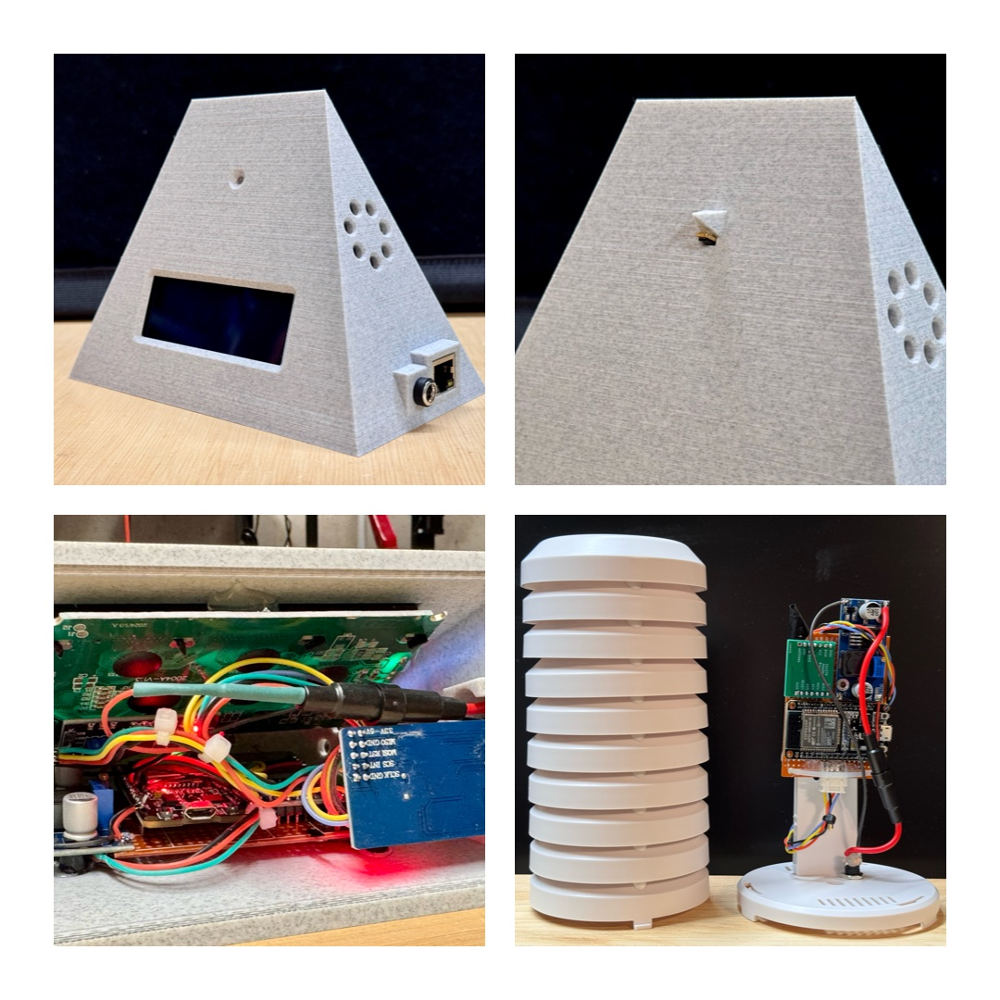

# Dew Point Thermometer with LoRa and Internet Connectivity

|  | 
|:--:| 
| *T = Temperature, H = Humidity, D = Dewpoint. Significant delta in D between indoor and outdoor indicated by LED* |

## Table of Contents
- [Introduction and Motivation](#introduction-and-motivation)
- [Features](#features)
- [Changelog](#changelog)
- [Design Principles](#design-principles)
- [Hardware Components](#hardware-components)
- [Wiring](#wiring)
- [Frequency, Sync Word, and CRC](#frequency-sync-word-and-crc)
- [Software Setup](#software-setup)
- [Housing](#housing)
- [Usage](#usage)
- [Maintenance and Troubleshooting](#maintenance-and-troubleshooting)
- [License](#license)

## Introduction and Motivation

In atmospheric science and indoor air quality management, the **dew point** is a critical metric. It represents the temperature at which the water vapor in the air becomes saturated and begins to condense into liquid water. A higher dew point indicates more moisture in the air, often leading to discomfort, potential mold growth, and structural damage. By understanding and controlling dew point, one can maintain healthier, more comfortable indoor conditions, prevent condensation-related issues, and optimize energy usage for heating and cooling. Monitoring dew point is thus invaluable in achieving both human comfort and long-term preservation of building materials.

This project implements a robust dew point thermometer system with a base station that connects via Lora to an indoor and outdoor sensor. The sensors measures temperature/humidity with a highly accurate SHT85 sensor. The base station receives this data from both sensors, calculates both indoor and outdoor dew points, and determines if airing the house out would help control indoor humidity or not. An LED indicator provides a quick visual guide for whether or not to ventilate, and an LCD display shows the current measured and calculated values for indoor & outdoor conditions. The system is connected to Adafruit Cloud for tracking and graphing data.

By employing a unique LoRa sync word, CRC checks, ensuring network connectivity before I/O operations, and using timed intervals for tasks, the system remains responsive and reliable—even in noisy RF environments or when Wifi or the Ethernet cable get disconnected. 

## Features

- **Indoor/Outdoor Measurements:**  
The system now uses separate LoRa sensor nodes for both indoor and outdoor measurements. Each sends temperature/humidity data autonomously at set intervals. Note that V1 of the project had the indoor sensor mounted at the back of the base station, but self-heating of the system due to the LCD lighting skewed measurements. Separating the sensors from the base station fixed the problem. 

- **Scientific Dew Point Calculation Using the Magnus Approximation:**  
  The dew point can be approximated using the Magnus–Tetens formula, which provides a practical way to compute dew point (`D`) based on temperature (`T`) and relative humidity (`H`). Different constants are used depending on whether the temperature is above or below 0°C:

     ```cpp
  double calculateDewPoint(double temp, double hum) {
  double a, b;
  if (temp >= 0.0) {
    a = 17.62; b = 243.12;
  } else {
    a = 22.46; b = 272.62;
  }
  double rh = hum / 100.0;
  double alpha = log(rh) + (a * temp / (b + temp));
  return (b * alpha) / (a - alpha);
  }
     ```
 

- **Humidity Control:**  
  - Compares indoor and outdoor dew points to assess the benefit of airing out to reduce indoor humidity.

- **LED Indicators for Ventilation:**
  - **Green LED:** Outdoor conditions favor lowering indoor humidity by airing (delta dew point >5C).
  - **Red LED:** No benefit from airing.
  - **Off:** Borderline conditions, marginal benefit (delta 0-5C).

- **Robust LoRa Communication:**
  - Unique sync word, CRC for reliable data in noisy environments.
  - Operates at 868.1 MHz (EU ISM band).

- **Non-Blocking, Responsive Operation:**
  - Timed intervals for sensor reads, LCD updates, Adafruit IO uploads.
  - Avoids stalling during network issues.

- **Failure Recovery:**
  - Reinitializes SHT85 and LoRa after multiple failures.
  - Uses flags to show old (stale) data as "---" on the LCD instead of resetting values to zero.

- **Optional Cloud Connectivity (Adafruit IO):**
  - Uploads data every 5 minutes if Wi-Fi or Ethernet is connected.
  - Skips uploads gracefully if disconnected.

## Changelog from Version 1.0 to 2.0:

- Data Acquisition Approach:
    Changed from a request/response model (indoor station requesting outdoor data) to both indoor and outdoor sensors autonomously sending data over LoRa at fixed intervals. The base station now only listens, simplifying communication.

- Multiple Sensor Nodes for Indoor/Outdoor:
    Instead of measuring indoor conditions at the main station, a separate indoor LoRa sensor node sends indoor data. This allows flexible placement of the indoor sensor, potentially reducing self-heating and interference.

 - Stale Data Handling:
    Instead of resetting values to 0.0 when data is old, the code now uses boolean flags to indicate old data. The LCD displays "---" for stale indoor or outdoor data, clearly distinguishing no-data scenarios from actual zero values.

 - Humidity Rounding Improvement:
    Humidity is now rounded before displaying, ensuring values like 37.6% appear as 38% rather than truncating.

- Sleep Feature: 
  The sensor nodes now use deep sleep between transmissions, significantly reducing power consumption and avoiding self-heating issues inside the sensor enclosure (<0.01C - beyond accuracy of sensor). This helps maintain more accurate measurements and prolongs battery life when operating off-grid.

## Design Principles

1. **Reliability in Noise:**  
   - Unique sync word and CRC filter interference.
   - Verifies network connectivity before I/O ops.

2. **Non-Blocking Operation:**  
   - Uses timed intervals to prevent system stalls.

3. **Error Handling & Recovery:**  
   - Reinitializes sensors and LoRa on failures.
   - Clears old outdoor data if no updates in 1 minute.

4. **Modularity & Maintainability:**  
   - Separate indoor/outdoor code.
   - Clear logic and timing-based structure.

## Hardware Components

### Sensors (Indoor and Outdoor)
- ESP32 (or similar MCU)
- SHT85 Temp/Hum Sensor (3.3V)
- LoRa Module (SX1276/SX1278, 3.3V)
- Stable 3.3V power supply or use a DC-DC step down module

### Indoor Station
- ESP32 with EiFi (3.3V)
- W5500 Ethernet Module (3.3V)
- LoRa Module (SX1276, 3.3V)
- 20x4 I2C LCD Display (5.0V)
- Bi-Color LED or separate Red/Green LEDs (3.3V via PWM)
- Logic Level Converter for LCD I2C Lines, e.g. TXS0108E
- Stable 5V supply via DC-DC step down module. For 3.3V, simply use the ESP 3.3V out. 

## Wiring

**Note:** The ESP32, LoRa, and Ethernet modules operate at 3.3V logic. The LCD typically requires 5V and is not 3.3V tolerant on I2C lines. Use a bidirectional logic level converter for I2C SDA and SCL lines between ESP32 (3.3V) and LCD (5V).

|  | 
|:--:| 
| *Left: Wiring & Prototype Testing. Top Right: LCD Display Testing. Bottom Right: Assembled Components* |

Below are the wiring instructions. Use short, direct references and keep related signals grouped. All components except the LCD and LEDs run at 3.3V logic. The LCD is 5V and requires a logic level converter for the I2C lines.

### Sensor Station Wiring

**SHT85 Sensor (3.3V I2C):**
- SCL -> ESP32 GPIO22 (I2C Clock)
- SDA -> ESP32 GPIO21 (I2C Data)
- VCC -> 3.3V
- GND -> GND

**LoRa Module (3.3V SPI):**
- SCK -> ESP32 GPIO18
- MISO -> ESP32 GPIO19
- MOSI -> ESP32 GPIO23
- NSS (CS) -> ESP32 GPIO5
- RST -> ESP32 GPIO27
- VCC -> 3.3V
- GND -> GND

*(DIO0 is not used)*

### Indoor Station Wiring

**LoRa Module (3.3V SPI):**
- SCK -> ESP32 GPIO18
- MISO -> ESP32 GPIO19
- MOSI -> ESP32 GPIO23
- NSS (CS) -> ESP32 GPIO5
- RST -> ESP32 GPIO27
- VCC -> 3.3V
- GND -> GND

**LCD (5V I2C, with Level Shifter):**
- ESP32 GPIO21 (SDA) -> Level Shifter (3.3V side)
- ESP32 GPIO22 (SCL) -> Level Shifter (3.3V side)
- Level Shifter (5V side) -> LCD SDA/SCL
- LCD VCC -> 5V
- LCD GND -> GND

Make sure the level shifter is bidirectional and designed for I2C signals. Connect its power pins:
- Level Shifter LV (low voltage side) -> 3.3V from ESP32
- Level Shifter HV (high voltage side) -> 5V
- GND shared among ESP32, LCD, and Level Shifter

**Ethernet (W5500) Optional (3.3V SPI):**
- SCK -> ESP32 GPIO18 (shared SPI)
- MISO -> ESP32 GPIO19
- MOSI -> ESP32 GPIO23
- CS -> ESP32 GPIO4
- VCC -> 3.3V
- GND -> GND

**LEDs (3.3V):**
- RED_LED_PIN (GPIO25) -> Red LED + resistor -> GND
- GREEN_LED_PIN (GPIO26) -> Green LED + resistor -> GND

Keep wiring as short as possible, ensure common ground among all devices, and double-check voltage levels before powering up. For the LCD, ensure the logic signals from the ESP32 go through the level shifter for stable 5V I2C operation.

## Frequency, Sync Word, and CRC

```cpp
const long frequency = 868100000; // 868.1 MHz for EU ISM band
LoRa.setSyncWord(0x13); // Unique sync word for your network
LoRa.enableCrc(); // Ensure packet integrity with CRC
```

## Software Setup

1. **Clone Repository:**
   ```bash
   git clone https://github.com/yourusername/dew-point-thermometer.git
   cd dew-point-thermometer
   ```

2. **Install Required Libraries:**
   - [arduino-LoRa](https://github.com/sandeepmistry/arduino-LoRa)
   - [Ethernet_Generic](https://github.com/khoih-prog/Ethernet_Generic)
   - [LiquidCrystal_I2C](https://github.com/johnrickman/LiquidCrystal_I2C)
   - [SHTSensor](https://github.com/Sensirion/arduino-sht)
   - [AdafruitIO_WiFi](https://github.com/adafruit/Adafruit_IO_Arduino)
   - [AdafruitIO_Ethernet](https://github.com/adafruit/Adafruit_IO_Arduino)

3. **Configure Credentials:**
   - In base station code:
     ```cpp
     const char* ssid = "YourWiFiSSID";
     const char* password = "YourWiFiPassword";
     ```
     ```cpp
     #define IO_USERNAME "your_adafruit_io_username"
     #define IO_KEY "your_adafruit_io_key"
     ```
   - In sensor code:
     ```cpp
     //Set to "IN" for Indoor Sensor
     //Set to "OUT" for Outdoor Sensor
     const String inOrOut = "OUT"; 
     ```

4. **Upload Code:**
   - Upload [DewPoint_BaseStation.ino](DewPoint_BaseStation.ino) to outdoor ESP32.
   - Upload [DewPoint_Sensor.ino](DewPoint_Sensor.ino) to indoor ESP32.
   - Ensure same frequency & sync word on both units.

## Housing

|  | 
|:--:| 
| *Top Left: Custom Indoor Housing with LED, LCD, DC & Ethernet connector, air vents. Top Right: Small cut-out for sensor. Bottom Left: Mounting via spacers and (hot) glue. Bottom right: Outdoor FTA Housing. For both, indoor and outdoor housing, the DC connector is connected to a 0.2A fuse for safety* |

- **Sensor Units:**  
  Weatherproof enclosure, ensure airflow for accurate humidity readings.
  Good quality housing: TFA Dostmann Potective Cover for Transmitter. 

- **Indoor Base Station:**
  - Indoor Housing was designed using CAD Onshape.
  - Link to my [Onshape design](https://cad.onshape.com/documents/c48dac3dd317ad2774113701/w/70a39c90a07f91a9a65c84c1/e/97dbad388adcff361e7d9df7) to my design.  
  - [3D STL file for printing](Base_Station_3D_Print)


## Usage

1. **Power Up the Units:**
  - Outdoor and indoor sensor nodes send data every set interval automatically.
  - Base station listens continuously and updates display.

2. **LED Ventilation Guidance:**
   - Green: Airing out helps reduce indoor humidity.
   - Red: No benefit from airing out.
   - Off: Borderline conditions.

3. **Automatic Recovery:**
   - Outdoor data resets after 1 minute if no updates.
   - Sensor and LoRa reinitialized after repeated failures.
  
4. **Cloud Upload (Optional):**
   - If connected to wifi or Ethernet, the indoor unit uploads data to Adafruit IO every 5 mins:

 

## Maintenance and Troubleshooting

- **Sensor Issues:**  
  Check SHT85 wiring. Code attempts reinitialization after multiple failures.

- **LoRa Communication Problems:**  
  Ensure same frequency, sync word, and CRC on both ends.  
  Check antennas and signal environment.

- **LCD or LED Problems:**  
  Verify I2C address and wiring for LCD.  
  Use a level shifter for I2C lines since LCD runs at 5V.  
  Check LED pins and resistor values.

- **Network Failures:**  
  Check Wi-Fi credentials or Ethernet cable and DHCP.  
  Code retries periodically without blocking main loop.


## License

This project is released under the [MIT License](LICENSE).
